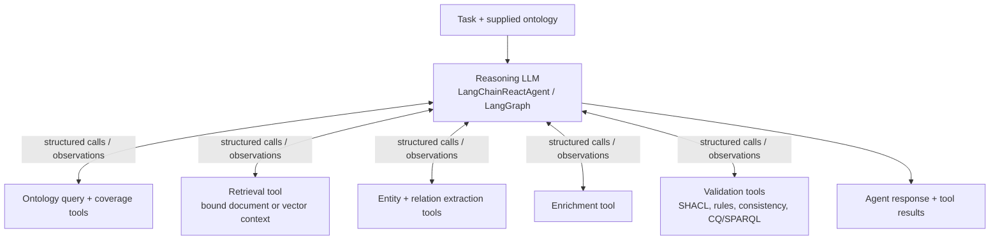
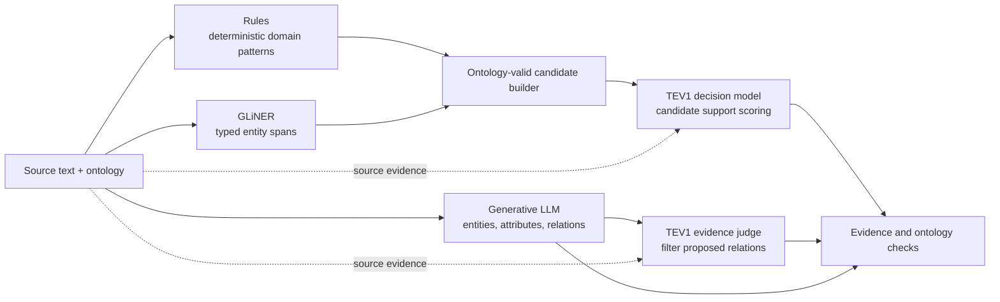

# KnowledgeGraphBuilder

**Ontology-guided Knowledge Graph extraction with agents, tools, and skills**
for building validated, traceable knowledge graphs from unstructured documents.

Ingests documents (PDF, DOCX, PPTX, XML), extracts entities and relations guided
by an OWL ontology, assembles a validated knowledge graph in Neo4j, and exports
it in multiple standard formats (JSON-LD, RDF/Turtle, YARRRML, Cypher).

**Research context:** An earlier version of KnowledgeGraphBuilder was presented
at the **SEMANTiCS 2026 conference**. The current implementation extends that
version with Workbench integration, composable agent tools/skills, configurable
model providers, and extraction benchmarks.

For application integration, start with the
[KG Workbench extraction API guide](docs/guide/extraction-api.md). For model
comparisons, see the [published benchmark reports](Planning/benchmarks/expanded/README.md)
and their [execution status and limitations](Planning/benchmarks/expanded/STATUS.md).

A minimal sample dataset is available at `data/smoke_test/` (ontology + text
file) for quick local experiments and to exercise the `scripts/quickstart.py`
workflow.

Part of a three-repository research ecosystem:

| Repository | Purpose | Branch |
|-----------|---------|--------|
| **KnowledgeGraphBuilder** (this repo) | KG construction, validation, and export | `main` |
| [GraphQAAgent](https://github.com/DataScienceLabFHSWF/GraphQAAgent) | Ontology-informed GraphRAG QA agent | `dev/fast-api-backend` |
| [OntologyExtender](https://github.com/DataScienceLabFHSWF/OntologyExtender) | Human-in-the-loop ontology extension | `fast-api` |

All three are orchestrated together via [KGPlatform](https://github.com/DataScienceLabFHSWF/KGPlatform), but each works standalone with its own `docker-compose.yml`.

[KG Workbench](https://github.com/DataScienceLabFHSWF/kg-workbench) is an additional
application integration: it submits documents and ontologies to KGBuilder's
external extraction API and imports the resulting entities and facts.

---

## Table of Contents

- [What This Repository Does](#what-this-repository-does)
- [Application Integration and Current Status](#application-integration-and-current-status)
- [Pipeline Architecture](#pipeline-architecture)
- [Quick Start](#quick-start)
- [Build a KG from Your Own Data](#build-a-kg-from-your-own-data)
- [Infrastructure](#infrastructure)
- [Project Structure](#project-structure)
- [Module Reference](#module-reference)
- [Domain Pluggability](#domain-pluggability)
- [Validation and Quality Scoring](#validation-and-quality-scoring)
- [Experiment Framework](#experiment-framework)
- [Key Scripts](#key-scripts)
- [Technology Stack](#technology-stack)
- [Configuration](#configuration)
- [Development](#development)
- [API Documentation](#api-documentation)
- [Documentation Index](#documentation-index)
- [Related Work](#related-work)
- [License](#license)

---

## Application Integration and Current Status

### KG Workbench API

| Endpoint | Purpose |
|----------|---------|
| `POST /api/extract` | Submit `runId`, document/ontology IDs, a base64 file, and an inline ontology |
| `GET /api/extract/{runId}/status` | Poll execution status and integer progress |
| `GET /api/extract/{runId}/results` | Fetch `sections`, typed `entities`, and evidence-backed `facts` |

Status/results require a bearer key configured through `KGBUILDER_API_KEY`.
POST currently remains unauthenticated; keep the service on a trusted network
or behind an authenticated proxy. Run state is in memory, so use one API process
and expect jobs to be lost on restart.

Workbench's actual adapter has been tested across containers against real
Kolibri/vLLM inference on a small fixture. Deployment settings and contract
details are in the [extraction API guide](docs/guide/extraction-api.md).

Uploaded-file extraction does **not** query a vector index. The separate
retrieval-backed build route currently uses Qdrant; Supabase/pgvector retrieval
is not implemented. Supabase file storage alone does not provide a vector index.

### Model roles and orchestration

- **Generation:** select Ollama or vLLM with `LLM_BACKEND`; a separate Kolibri
  deployment profile uses Aleph Alpha's vLLM plugin.
- **Entity spans:** GLiNER is an optional benchmark path, not a triple or
  attribute generator.
- **Decision scoring/judging:** TEV1 scores supplied candidate triples or
  checks source support for proposed relations through Ollama's decision API.
  It cannot recover facts omitted by candidate generation.
- **Current public extraction:** fixed module/entity/relation stages use a
  generative LLM. GLiNER and TEV are not enabled in that route.
- **Dynamic tool calling:** `LangChainReactAgent` uses a LangGraph loop in
  which an LLM selects structured tools and observes their results. Tools are
  supplied by the caller with bound resources; this adapter is implemented,
  but is not the public endpoint's controller.

See the [architecture diagrams](docs/architecture/agentic-pipeline.md) and
[provider/benchmark guide](docs/guide/model-providers-and-benchmarks.md).
The architecture below distinguishes dynamic tool calling, declared skill
plans, and the deployed API workflows.

### Published evaluation

[Pilot reports](Planning/benchmarks/pilots/README.md) and
[expanded reports](Planning/benchmarks/expanded/README.md) contain aggregate-only
JSON and Markdown measurements for quality, token usage, and KG richness.
Detailed reports retain per-run measurements; conference-era runtime totals
are not representative of the current architecture.
The expanded publication covers seven completed configurations, with 22 bilingual
development examples repeated three times and 260 eligible real-PDF passages
per completed configuration.

These are **not held-out or independently reviewed quality scores**. Corpus
counts measure extraction output, not accuracy; errors and skipped PDFs matter.
The [publication status](Planning/benchmarks/expanded/STATUS.md) documents the
failed TEV-judge run and pending Qwen runs at the time of publication.
Raw passages, predictions, evidence quotes, and logs remain local.

---

## What This Repository Does

1. **Document ingestion** -- loads PDFs, DOCX, PPTX, and German law XML;
   chunks them semantically; embeds them into Qdrant for hybrid retrieval.
2. **Ontology-guided extraction** -- generates LLM prompts from OWL class and
   property definitions; extracts entities and relations with confidence
   scores and provenance verification (via `TextAligner`, inspired by
   Google's [LangExtract](Planning/LANGEXTRACT_EVAL.md) library).
3. **Autonomous discovery** -- iteratively generates competency questions,
   retrieves relevant chunks, and extracts additional facts until coverage
   converges (see [Architecture](Planning/02_ARCHITECTURE.md) Section 2).
4. **Selectable extraction capabilities** -- generative LLM extraction,
   domain-specific rules, GLiNER entity spans, and TEV candidate scoring or
   evidence judging. Separate benchmark paths compare these combinations;
   the public extraction API currently uses generative LLM extraction.
5. **Confidence tuning** -- statistical analysis, multi-source boosting,
   coreference resolution, LLM consensus voting, and quality filtering.
6. **Enrichment capabilities** -- descriptions, semantic embeddings,
   competency questions, type constraints, and alias generation, exposed
   through reusable tools and skills.
7. **KG assembly and validation** -- assembles nodes and edges in Neo4j;
   validates against SHACL shapes generated from the ontology; runs pySHACL
   and (optionally) SHACL2FOL/Vampire static checks; calculates automated
   quality scores.
8. **Analytics** -- OWL-RL inference, SKOS enrichment, graph metrics
   (centrality, connectivity, coverage).
9. **Export** -- JSON-LD, RDF/Turtle, Cypher, GraphML, N-Triples, and
   plain JSON.
10. **Experiment framework** -- manages multi-variant runs with W&B logging,
    checkpointing, automated SHACL quality scoring, and HTML reports.
11. **KG versioning** -- snapshot, restore, and diff operations for
    reproducible experiment tracking.
12. **Agentic orchestration** -- a dynamic LLM tool-calling adapter and
    composable tools/skills/subagents: one extraction subagent per
    ontology module (dispatched concurrently, optionally on different
    models), and a dedicated validation subagent that consumes VCQ
    (validating) competency questions instead of only SCQ/RCQ (scoping/
    relationship) ones. See [Agentic Pipeline](docs/architecture/agentic-pipeline.md).

The pipeline is **ontology-agnostic**: it reads whatever OWL ontology is
provided and auto-generates extraction prompts, SHACL shapes, and validation
rules from it. Different knowledge domains share the same code -- only the
ontology and document loaders change.

---

## Pipeline Architecture

The current architecture is organized around **capabilities**, rather than
the conference version's extraction/enrichment/persistence layers. An agent
receives an ontology and a task, while tools receive explicitly bound resources
such as document context, retrievers, model providers, and validators.

### Dynamic reasoning and tool calls

`LangChainReactAgent` implements the LLM-driven control loop. The LLM chooses
from the tools supplied to that agent, receives observations, and can make
further calls before returning an answer. The arrows below describe available
interactions, **not a mandatory execution order**.



**Tools** wrap bounded operations; **skills** compose tools into reusable work
units; **module subagents** bind those capabilities to ontology-specific
resources. The registry centralizes the available capabilities.
`PipelineAgent` provides a separate way to compose skills in declared Markdown
plans, with explicit resource bindings and result flow. A declared plan is
reconfigurable, but it is not LLM-selected control flow.

### Extraction model roles

The **reasoning LLM remains the thinking and tool-routing component**.
Extraction models and decision models perform bounded subtasks; TEV does not
replace the controller, invent missing proposals, or perform ontology reasoning.



This second diagram describes **alternative extraction/benchmark paths**, not
a sequence every request runs. Generative extraction uses Ollama or vLLM;
GLiNER is a separate span model, and TEV uses Ollama's decision API. GLiNER/TEV
paths are benchmarkable but are not currently registered as dedicated tools
in the dynamic agent or enabled in the public extraction route. Connecting
them to the controller is distinct from implementing their extractors.

### Deployed entry points

| Entry point | Controller | Context and output |
|-------------|------------|--------------------|
| `LangChainReactAgent` (Python adapter) | LLM dynamically selects supplied structured tools | Caller-bound resources; agent response and tool results |
| `POST /api/extract` | Module subagents, then paragraph relation extraction | Uploaded file + inline ontology; Workbench sections/entities/facts |
| `POST /api/v1/build` | `PipelineAgent` executes a declared skill plan | Qdrant retrieval + ontology; assembly in Neo4j and optional SHACL validation |

Creating module agents dynamically is not the same as dynamically selecting
tools with an LLM. The API routes reuse the agent/skill infrastructure, but do
not yet invoke the reasoning adapter as their controller.

See [Agentic Pipeline](docs/architecture/agentic-pipeline.md) for tool bindings,
module dispatch, validation boundaries, and the remaining controller wiring.
The [earlier architecture notes](Planning/02_ARCHITECTURE.md) retain historical
design context rather than defining the current runtime.

---

## Quick Start

### Option 1: Docker (Recommended)

```bash
git clone https://github.com/DataScienceLabFHSWF/KnowledgeGraphBuilder.git
cd KnowledgeGraphBuilder
cp .env.example .env

# Start everything — Neo4j + Qdrant + Fuseki + Ollama + API + auto model pull
docker compose up -d --build

# API: http://localhost:8001/docs
# Neo4j: http://localhost:7474
# Qdrant: http://localhost:6333/dashboard
# Fuseki: http://localhost:3030
```

Container names are prefixed with `kgb-` to avoid conflicts with other stacks.

### Option 2: As Part of KGPlatform

```bash
git clone --recurse-submodules https://github.com/DataScienceLabFHSWF/KGPlatform.git
cd KGPlatform
docker compose up -d  # starts all 3 APIs + shared infra
```

### Option 3: Local Development

```bash
git clone https://github.com/DataScienceLabFHSWF/KnowledgeGraphBuilder.git
cd KnowledgeGraphBuilder
cp .env.example .env
pip install -e ".[dev]"
./scripts/setup_shacl2fol.sh  # optional: download SHACL2FOL dependencies

# Start infrastructure
docker compose up -d kgb-neo4j kgb-qdrant kgb-fuseki kgb-ollama kgb-ollama-init

# Run the full pipeline (single iteration for quick test)
source .venv/bin/activate
export PYTHONPATH=$PWD/src:$PYTHONPATH
python scripts/full_kg_pipeline.py --max-iterations 1

# With law graph context augmentation
LAW_GRAPH_ENABLED=true python scripts/full_kg_pipeline.py --max-iterations 1
```

For law-specific pipeline setup, see [docs/getting-started/quickstart-law-graph.md](docs/getting-started/quickstart-law-graph.md).

See `python scripts/full_kg_pipeline.py --help` for all CLI options including
`--enrich-only`, `--skip-enrichment`, `--skip-analytics`, `--checkpoint`, and
`--dry-run`.

---

## Build a KG from Your Own Data

The pipeline is domain-agnostic. You need **three inputs** to build a Knowledge
Graph for any domain:

| Input | Format | Example |
|-------|--------|---------|
| **Ontology** | OWL / RDF / TTL file | `data/ontology/my-domain.owl` |
| **Documents** | PDF, DOCX, PPTX, TXT, MD | `data/my-domain-docs/` |
| **Competency Questions** *(optional)* | Plain text, one per line | `data/my-cqs.txt` |

### 1. Prepare your inputs

```
data/
  ontology/
    my-domain.owl            # your OWL ontology
  my-domain-docs/
    report-a.pdf             # your source documents
    manual-b.docx
    ...
  my-cqs.txt                 # optional: competency questions
```

**Ontology** -- an OWL file defining the classes and properties you want to
extract. The pipeline reads class labels and relation definitions from it to
guide entity and relation extraction.

**Documents** -- any number of PDFs, Word files, PowerPoint decks, or plain-text
files. These are chunked, embedded, and indexed into Qdrant for retrieval.

**Competency Questions** -- natural-language questions that your KG should be
able to answer (e.g. *"Which suppliers deliver hazardous materials?"*). They
steer the iterative discovery loop toward relevant entities.

### 2. Start infrastructure

```bash
docker-compose up -d neo4j qdrant fuseki ollama
```

### 3. Run the quickstart script

```bash
python scripts/quickstart.py \
    --ontology data/ontology/my-domain.owl \
    --documents data/my-domain-docs/ \
    --cqs data/my-cqs.txt \
    --max-iterations 2
```

The script runs all four stages automatically:

1. **Upload ontology** to Fuseki (creates a SPARQL dataset)
2. **Ingest documents** -- parse, chunk, embed, index into Qdrant
3. **Extract entities & relations** -- ontology-guided LLM extraction with
   iterative discovery loop
4. **Validate** -- SHACL conformance check and quality scoring

Results are written to `output/<domain>/` and persisted in Neo4j.

### CLI options

| Flag | Default | Description |
|------|---------|-------------|
| `--ontology` | *(required)* | OWL ontology file path |
| `--documents` | *(required)* | Directory with source documents |
| `--cqs` | none | Competency questions file |
| `--max-iterations` | `2` | Discovery loop iterations |
| `--questions-per-class` | `3` | Research questions per class |
| `--confidence-threshold` | `0.5` | Min entity confidence |
| `--top-k` | `10` | Chunks per retrieval query |
| `--extensions` | `.pdf .docx .pptx .txt .md` | File types to ingest |
| `--dry-run` | off | Extract without DB writes |
| `--skip-ingest` | off | Skip if docs already indexed |
| `--skip-validation` | off | Skip SHACL validation |

### 4. Explore the result

Open Neo4j Browser at <http://localhost:7474> and run:

```cypher
MATCH (n) WHERE n.graph_type = 'my-domain' RETURN n LIMIT 100
```

A JSON checkpoint with all entities and relations is also saved in
`output/<domain>/checkpoint.json`.

### Templates

- **Profile config**: [`data/profiles/template.json`](data/profiles/template.json)
- **CQ file template**: [`data/examples/competency_questions_template.txt`](data/examples/competency_questions_template.txt)

---

## Infrastructure

All services run via Docker Compose. Models are pulled automatically.

```bash
docker compose up -d
```

| Service | Container | Port | Purpose |
|---------|-----------|------|---------|
| Neo4j | kgb-neo4j | 7474 / 7687 | Knowledge graph storage (Cypher queries) |
| Qdrant | kgb-qdrant | 6333 | Vector similarity search (dimensions match the configured embedding model) |
| Fuseki | kgb-fuseki | 3030 | RDF/SPARQL ontology store |
| Ollama | kgb-ollama | 11435 | Local LLM inference and embedding generation |
| API | kgb-api | 8001 | FastAPI service for KG construction |

When running as part of **KGPlatform**, infrastructure is shared across all
three repos (KGBuilder, GraphQA, OntologyExtender) — this file's
`docker-compose.yml` is not used.

---

## Project Structure

```
src/kgbuilder/
  core/             Protocols, data models, exceptions, config
  document/         Document loaders (PDF, DOCX, PPTX, law XML) and chunking
  embedding/        Embedding generation + structured LLM output (Ollama)
  extraction/       Entity and relation extraction (LLM + rule-based + ensemble)
                    Text alignment (aligner.py), extraction chains, caching
  confidence/       Confidence tuning (analyzer, booster, calibrator,
                    coreference resolver, filter, consensus voter)
  enrichment/       Post-extraction enrichment pipeline (5 phases)
  assembly/         KG assembly (SimpleKGAssembler, multi-store KGBuilder)
  validation/       SHACL shape generation, pySHACL validator, SHACL2FOL
                    static validator, rules engine, consistency checker,
                    quality scorer, reporter
  storage/          Neo4j, Qdrant, Fuseki, RDF, export, law retrieval
  analytics/        OWL-RL inference, SKOS enrichment, graph metrics
  retrieval/        BM25 + dense fusion retrieval
  agents/           Question generation (CQType-routed), iterative discovery
                    loop, module extraction subagents, orchestrator,
                    VCQ validation agent, agent-swarm model config
  skills/           Composable skill wrappers (retrieval, extraction, join,
                    ontology gap analysis, question/KG validation)
  tools/            Stateless tool wrappers around extractors, validators,
                    retrievers, and the SHACL/rules/consistency checks
  experiment/       Experiment manager, checkpoint, analyzer, plotter, reporter
  pipeline/         Orchestrators (build pipeline, confidence tuning,
                    stopping criterion, checkpoint CLI)
  versioning/       KG snapshot, restore, diff
  telemetry/        Observability integrations (LangSmith)
  cli.py            Typer CLI entry point

scripts/            Pipeline entry points and utility scripts
tests/              Unit and integration tests
data/
  ontology/         OWL ontologies (domain, legal, generated shapes)
  profiles/         Pipeline config overlays (per-domain settings)
  law_html/         German law XML files (from gesetze-im-internet.de)
Planning/           Architecture docs, interface specs, evaluation notes
```

---

## Module Reference

### Core (`core/`)

| Module | Key Classes | Purpose |
|--------|------------|---------|
| `protocols.py` | `DocumentLoader`, `EntityExtractor`, `RelationExtractor`, `EmbeddingProvider`, `LLMProvider`, `GraphStore`, `OntologyService` | Protocol definitions (dependency injection interfaces) |
| `models.py` | `Document`, `Chunk`, `Evidence`, `ExtractedEntity`, `ExtractedRelation`, `OntologyClassDef`, `OntologyRelationDef` | Shared data models (dataclasses) |
| `exceptions.py` | `KGBuilderError`, `DocumentLoadError`, `ExtractionError`, `ValidationError`, `StorageError` | Domain-specific exception hierarchy |
| `config.py` | `LLMConfig`, `EmbeddingConfig`, `Neo4jConfig`, `QdrantConfig` | Pydantic configuration models with env var support |

### Document Processing (`document/`)

| Module | Key Classes | Purpose |
|--------|------------|---------|
| `loaders/pdf.py` | `PDFLoader` | PDF ingestion via pdfplumber |
| `loaders/office.py` | `DOCXLoader`, `PPTXLoader` | Office document ingestion |
| `loaders/law_xml.py` | `LawXMLReader`, `LawDocument`, `LawParagraph` | German law XML parser (gesetze-im-internet.de) |
| `loaders/law_adapter.py` | `LawDocumentAdapter` | Converts `LawDocument` to KGB `Document` format |
| `chunking/strategies.py` | `SentenceChunker`, `ParagraphChunker`, `SemanticChunker`, `FixedSizeChunker` | Four chunking strategies |

### Extraction (`extraction/`)

| Module | Key Classes | Purpose |
|--------|------------|---------|
| `entity.py` | `LLMEntityExtractor` | Ontology-guided entity extraction via LLM |
| `relation.py` | `LLMRelationExtractor` | Ontology-guided relation extraction with domain/range validation |
| `rules.py` | `RuleBasedExtractor` | Deterministic heuristic extraction (regex, gazetteers) |
| `ensemble.py` | `TieredExtractor`, `TieredRelationExtractor`, `EnsembleExtractor` | Tiered (rules then LLM) and ensemble merge strategies |
| `legal_rules.py` | `LegalRuleBasedExtractor` | Legal-domain rules (paragraph refs, authorities, deontic modalities) |
| `legal_llm.py` | `LegalLLMExtractor` | Legal-domain LLM extractor with German prompts |
| `legal_ensemble.py` | `LegalEnsembleExtractor` | Legal rule + LLM merger with weighted confidence |
| `aligner.py` | `TextAligner`, `AlignmentResult`, `AlignmentStatus` | Source-text verification (inspired by LangExtract `WordAligner`) |
| `synthesizer.py` | `FindingsSynthesizer` | Cross-document entity deduplication and relation consolidation |
| `chains.py` | `build_entity_chain`, `build_relation_chain` | LangChain-style extraction chain builders |
| `cache.py` | `OllamaResponseCache` | Persistent disk cache for LLM responses |
| `benchmarking.py` | `StructuredGenerationBenchmark` | Benchmark structured output success rate |

### Confidence (`confidence/`)

| Module | Key Classes | Purpose |
|--------|------------|---------|
| `analyzer.py` | `ConfidenceAnalyzer` | Statistical analysis (mean, std, percentiles, IQR anomaly detection) |
| `booster.py` | `ConfidenceBooster` | Multi-source boosting (+0.15 per additional document) |
| `calibrator.py` | `ConfidenceCalibrator` | Cross-pass confidence normalization |
| `coreference.py` | `CoreferenceResolver` | Merge entities referring to the same real-world object |
| `filter.py` | `ConfidenceFilter` | Adaptive threshold quality filtering |
| `voter.py` | `ConsensusVoter` | Multi-source voting for entity type disambiguation |

### Enrichment (`enrichment/`)

| Module | Key Classes | Purpose |
|--------|------------|---------|
| `pipeline.py` | `SemanticEnrichmentPipeline` | Five-phase enrichment orchestrator |
| `enrichers.py` | `DescriptionEnricher`, `EmbeddingEnricher`, `CompetencyQuestionEnricher`, `TypeConstraintEnricher`, `AliasEnricher` | Individual enrichment phases |
| `protocols.py` | `Enricher` | Protocol for enrichment plugins |

### Validation (`validation/`)

| Module | Key Classes | Purpose |
|--------|------------|---------|
| `shacl_generator.py` | `SHACLShapeGenerator` | Generate SHACL shapes from OWL ontology |
| `shacl_validator.py` | `SHACLValidator` | pySHACL validation with auto Neo4j-to-RDF conversion |
| `static_validator.py` | `StaticValidator` | SHACL2FOL + Vampire satisfiability checking |
| `rules_engine.py` | `RulesEngine`, `DomainRangeRule`, `FunctionalPropertyRule`, `TransitiveRule` | Semantic constraint rules |
| `consistency_checker.py` | `ConsistencyChecker` | Type/value conflict detection |
| `scorer.py` | `KGQualityScorer`, `KGQualityReport` | Weighted quality score (SHACL + coverage + consistency) |
| `reporter.py` | `ValidationReporter` | Markdown/HTML validation reports |

### Assembly and Storage (`assembly/`, `storage/`)

| Module | Key Classes | Purpose |
|--------|------------|---------|
| `assembly/kg_builder.py` | `KGBuilder` | Multi-store write orchestrator (Neo4j + Qdrant + Fuseki) |
| `assembly/simple_kg_assembler.py` | `SimpleKGAssembler` | Simplified assembler for single-store use |
| `storage/neo4j_store.py` | `Neo4jGraphStore` | Cypher-based graph CRUD operations |
| `storage/rdf_store.py` | `RDFStore` | RDF triple store (Fuseki SPARQL endpoint) |
| `storage/vector.py` | `QdrantVectorStore` | Vector similarity search operations |
| `storage/export.py` | `KGExporter` | Multi-format export (JSON-LD, Turtle, Cypher, GraphML) |
| `storage/law_retrieval.py` | `LawRetrievalService` | Law-graph-specific retrieval for hybrid QA |

### Analytics (`analytics/`)

| Module | Key Classes | Purpose |
|--------|------------|---------|
| `inference.py` | `Neo4jInferenceEngine` | OWL-RL inference (transitive closure, symmetry, inverse) |
| `skos.py` | `SKOSEnricher` | SKOS broader/narrower taxonomy enrichment |
| `metrics.py` | `GraphMetrics` | Node/edge counts, centrality, typed coverage analysis |
| `pipeline.py` | `AnalyticsPipeline` | Analytics orchestrator (inference + SKOS + metrics) |

### Experiment and Pipeline (`experiment/`, `pipeline/`)

| Module | Key Classes | Purpose |
|--------|------------|---------|
| `experiment/manager.py` | `ExperimentManager` | Multi-variant experiment orchestration with W&B |
| `experiment/checkpoint.py` | `CheckpointManager` | Checkpoint save/load for extraction results |
| `experiment/analyzer.py` | `ExperimentAnalyzer` | Cross-variant performance analysis |
| `experiment/plotter.py` | `ExperimentPlotter` | Convergence and comparison plots |
| `experiment/reporter.py` | `ExperimentReporter` | HTML experiment reports |
| `pipeline/orchestrator.py` | `BuildPipeline`, `BuildPipelineConfig` | Top-level pipeline with stopping criteria |
| `pipeline/stopping_criterion.py` | `StoppingCriterionChecker` | Coverage, confidence, stability checks |
| `pipeline/confidence_tuning.py` | `ConfidenceTuningPipeline` | Six-stage confidence refinement orchestrator |
| `pipeline/checkpoint_cli.py` | `enrich_from_checkpoint` | Standalone checkpoint re-enrichment |

### Agents, Skills, and Tools (`agents/`, `skills/`, `tools/`)

See [docs/architecture/agentic-pipeline.md](docs/architecture/agentic-pipeline.md)
for the full design. Summary:

| Module | Key Classes | Purpose |
|--------|------------|---------|
| `agents/question_generator.py` | `QuestionGenerationAgent`, `ResearchQuestion`, `CQType` | Generates research questions from ontology gaps, typed SCQ/VCQ/RCQ/FCQ/MpCQ (Keet & Khan QuO model) |
| `agents/module_extraction_agent.py` | `ModuleExtractionAgent` | Runs SCQ/RCQ extraction for one ontology module (own retriever/extractor pair) |
| `agents/orchestrator_agent.py` | `OrchestratorAgent`, `ModuleBinding` | Builds one subagent per module from `OntologyService.get_module_class_map()`, runs them concurrently, joins/dedupes results |
| `agents/validation_agent.py` | `ValidationAgent` | Runs VCQ questions: retrieves evidence, asks a validator if KG content answers it correctly/completely |
| `agents/swarm_config.py` | `SwarmModelConfig`, `build_module_bindings_with_swarm_config` | Per-module model assignment + concurrency limits for the module orchestrator |
| `agents/discovery_loop.py` | `IterativeDiscoveryLoop` | Top-level loop; routes SCQ/RCQ to module orchestration (when `module_map` supplied) and VCQ to `ValidationAgent` |
| `skills/module_extraction_skill.py`, `skills/join_skill.py` | `ModuleExtractionSkill`, `JoinModuleResultsSkill` | Retrieve+extract for one module; merge/dedupe results across modules |
| `skills/question_validation_skill.py`, `skills/kg_validation_skill.py` | `QuestionValidationSkill`, `KGValidationSkill` | VCQ-question validation; combined post-assembly SHACL+rules+consistency validation |
| `tools/extraction_tool.py`, `tools/relation_extraction_tool.py`, `tools/static_validation_tool.py` | `ExtractionTool`, `RelationExtractionTool`, `StaticValidationTool` | Stateless wrappers around entity/relation extractors and the SHACL2FOL pre-commit check |
| `tools/kg_validation_tools.py`, `tools/validation_tool.py` | `SHACLValidationTool`, `RulesEngineTool`, `ConsistencyCheckTool`, `ValidationTool` | Stateless wrappers around post-assembly and VCQ validators |

---

## Domain Pluggability

The pipeline is **ontology-agnostic**. Adding a new knowledge domain requires
no code changes to the core pipeline -- provide domain-specific components
and a config profile:

```
Step 1: Ontology
   Create/adopt OWL ontology -> load into Fuseki dataset

Step 2: Documents
   Place source files in data/<domain>/
   (or implement a custom DocumentLoader)

Step 3: Extractors (optional)
   Add domain-specific rules:
     extraction/<domain>_rules.py    -- regex/gazetteers
     extraction/<domain>_llm.py      -- specialized prompts
     extraction/<domain>_ensemble.py -- rule + LLM merge

Step 4: Profile
   Create data/profiles/<domain>.json with config overrides

Step 5: Run
   python scripts/full_kg_pipeline.py --profile data/profiles/<domain>.json
```

### Implemented Domains

| Domain | Ontology | Documents | Extractors |
|--------|----------|-----------|------------|
| Nuclear Decommissioning | `data/ontology/domain/decommissioning.owl` | 33 PDFs | Generic LLM + rules |
| German Federal Law | `law-ontology-v1.0.owl` (LKIF-Core + ELI) | ~6,800 XML files | `legal_rules.py` + `legal_llm.py` + `legal_ensemble.py` |

See [Planning/02_ARCHITECTURE.md](Planning/02_ARCHITECTURE.md) Section 12 for
the full domain pluggability design.

---

## Validation and Quality Scoring

Every KG build is scored automatically. The scorer generates SHACL shapes
from the OWL ontology, runs pySHACL against the graph, and computes a
weighted quality score:

| Metric | Description |
|--------|-------------|
| **Consistency** | SHACL2FOL satisfiability (optional, requires Vampire) |
| **SHACL conformance** | pySHACL violation count (always runs) |
| **Class coverage** | Fraction of ontology classes present in the graph |
| **Combined score** | Weighted aggregate in [0, 1] |

Additional validation layers:
- **Semantic rules engine** -- domain/range, functional property, transitive
  and inverse property checks
- **Consistency checker** -- detects type conflicts, value conflicts,
  cardinality violations

Run standalone:
```bash
PYTHONPATH=src python scripts/run_kg_scoring.py
```

See [Planning/VALIDATION_PLAN.md](Planning/VALIDATION_PLAN.md) for the full
validation architecture.

---

## Experiment Framework

The experiment framework supports systematic, reproducible evaluation:

```bash
# Single experiment run with W&B logging
python scripts/run_single_experiment.py

# Run experiment from config file
python scripts/run_experiment.py --config examples/experiment_baseline.json
```

Features:
- **Multi-variant runs** with automatic checkpointing
- **W&B integration** for metric tracking and visualization
- **SHACL quality scoring** per run (auto-generated from ontology)
- **HTML reports** with convergence analysis and variant comparison
- **Checkpoint-based re-enrichment** (`--enrich-only` mode, without repeating extraction)

See [examples/ABLATION_STUDY_GUIDE.md](examples/ABLATION_STUDY_GUIDE.md) for
ablation study setup.

---

## Key Scripts

| Script | Purpose |
|--------|---------|
| `quickstart.py` | **One-command KG build for any domain** (recommended entry point) |
| `full_kg_pipeline.py` | End-to-end KG construction pipeline (all domains) |
| `build_law_graph.py` | German federal law KG (structure-first, then semantic) |
| `build_law_ontology.py` | Generate the legal ontology OWL file |
| `run_kg_scoring.py` | Standalone SHACL quality scoring |
| `run_single_experiment.py` | Single experiment with W&B metrics |
| `run_experiment.py` | Experiment from JSON config |
| `validate_kg_complete.py` | Full KG validation suite |
| `manage_versions.py` | KG snapshot/restore/diff CLI |
| `enrich_checkpoint.py` | Standalone checkpoint enrichment |
| `load_ontology_to_fuseki.py` | Upload ontology to Fuseki SPARQL store |
| `merge_legal_ontologies.py` | Merge LKIF-Core + ELI into legal foundations |

---

## Technology Stack

| Component | Technology |
|-----------|-----------|
| Language | Python 3.11+ |
| LLM serving | Ollama or vLLM; Kolibri uses Aleph Alpha's vLLM plugin |
| Experimental extraction | GLiNER entity spans; TEV1 candidate scoring/evidence judging |
| Embeddings | Configured Ollama or vLLM embedding endpoint; model and dimensions must match the index |
| Graph DB | Neo4j 5.x |
| Vector DB | Qdrant |
| RDF Store | Apache Fuseki 4.x |
| Validation | pySHACL, SHACL2FOL + Vampire |
| Experiments | Weights & Biases |
| Logging | structlog (structured JSON) |
| Testing | pytest (with coverage) |
| Linting | ruff, mypy (strict), black |

---

## Configuration

Pipeline configuration uses Pydantic models with environment variable support:

```bash
# .env file (or export directly)
OLLAMA_URL=http://localhost:18134
NEO4J_URI=bolt://localhost:7687
NEO4J_USER=neo4j
NEO4J_PASSWORD=kgbuilder
QDRANT_URL=http://localhost:6333
FUSEKI_URL=http://localhost:3030
```

Per-domain overrides via JSON profiles in `data/profiles/`:
```bash
python scripts/full_kg_pipeline.py --profile data/profiles/legal.json
```

Agent-swarm model assignment (which module gets which model, and how many
module subagents run concurrently) is a separate, optional config layer --
see [`data/profiles/agent_swarm.example.json`](data/profiles/agent_swarm.example.json)
and `SwarmModelConfig` in
[docs/architecture/agentic-pipeline.md](docs/architecture/agentic-pipeline.md#agent-swarm-configuration).
`experiment.config.KGBuilderParams.swarm_config_path` lets experiment/
benchmark variants reference one.

See [Planning/03_INTERFACES.md](Planning/03_INTERFACES.md) for all protocol
definitions and configuration models.

---

## Development

Python 3.11 or newer is required.

### Branch workflow

- **`main`** is the stable release branch.
- **`dev`** is the shared integration branch for ongoing development.
- Create short-lived `feat/...`, `fix/...`, or `docs/...` branches from `dev`
  and open pull requests targeting `dev`.
- Promote tested changes with a pull request from `dev` to `main`.
  Keep `dev` synchronized with `main` after releases or main-only fixes.
- Existing research and historical branches are not integration targets.
  Check for unmerged work before deleting them.

```bash
git fetch origin
git switch dev
git pull --ff-only origin dev
git switch -c feat/my-change
# After committing and pushing, open a pull request with base branch dev.
```

This is the collaboration workflow, not an automatically enforced branch rule.
Required reviews and branch protection are configured separately on GitHub.

The outdated GitHub Actions workflows have been removed. Tests, linting,
type checks, documentation builds, and SHACL container checks remain available
locally; they no longer run automatically on pushes or pull requests.
Any required status checks in GitHub branch protection must be updated
separately if they reference the removed workflows.

```bash
# Install with dev dependencies
pip install -e ".[dev]"

# Run tests
pytest tests/

# Run tests with coverage
pytest tests/ --cov=src/kgbuilder --cov-report=term-missing

# Lint and type check
ruff check src/ tests/
mypy src/ --strict

# Format
black src/ tests/ scripts/
```

Code style: PEP 8, 100-char line length, full type hints (Python 3.11+
annotations), Google-style docstrings.

See [.github/copilot-instructions.md](.github/copilot-instructions.md) for
complete coding guidelines.

---

## API Documentation

The [extraction API guide](docs/guide/extraction-api.md) documents the KG Workbench
request/response contract, cross-container deployment, authentication, and
retrieval boundaries. A running API exposes interactive documentation at
`http://localhost:8001/docs`.

Auto-generated API documentation is available via MkDocs:

```bash
# Install docs dependencies
pip install -e ".[docs]"

# Serve documentation locally
mkdocs serve

# Build static site
mkdocs build
```

The documentation is generated from module docstrings using
[mkdocstrings](https://mkdocstrings.github.io/) and covers all public APIs.

---

## Documentation Index

| Document | Contents |
|----------|----------|
| [Planning/01_ACADEMIC_OVERVIEW.md](Planning/01_ACADEMIC_OVERVIEW.md) | Research context, motivation, and related work |
| [Planning/02_ARCHITECTURE.md](Planning/02_ARCHITECTURE.md) | Pipeline architecture, discovery loop, extraction details |
| [Planning/03_INTERFACES.md](Planning/03_INTERFACES.md) | Protocol definitions and interface contracts |
| [Planning/04_ISSUES_BACKLOG.md](Planning/04_ISSUES_BACKLOG.md) | Implementation status and roadmap |
| [Planning/VALIDATION_PLAN.md](Planning/VALIDATION_PLAN.md) | SHACL validation and scoring architecture |
| [Planning/LANGEXTRACT_EVAL.md](Planning/LANGEXTRACT_EVAL.md) | Evaluation of Google LangExtract (adopted patterns) |
| [Planning/AGENTIC_KG_PIPELINE_PLAN.md](Planning/AGENTIC_KG_PIPELINE_PLAN.md) | Skills/tools/subagents migration plan and status |
| [Planning/AGENT_TOOLBOX_INVENTORY.md](Planning/AGENT_TOOLBOX_INVENTORY.md) | Full inventory of every subagent, skill, and tool, and how they compose |
| [Planning/SEMANTICS2026_IMPROVEMENT_PLAN.md](Planning/SEMANTICS2026_IMPROVEMENT_PLAN.md) | Gap analysis and phased plan informed by SEMANTiCS 2026 (provenance, reasoning, repair agents, CQ-driven testing) |
| [docs/architecture/agentic-pipeline.md](docs/architecture/agentic-pipeline.md) | Agent swarm design: CQType routing, module subagents, VCQ validation, model/concurrency config |
| [docs/guide/extraction-api.md](docs/guide/extraction-api.md) | Workbench contract, deployment, authentication, and vector retrieval boundaries |
| [docs/guide/model-providers-and-benchmarks.md](docs/guide/model-providers-and-benchmarks.md) | Ollama/vLLM/Kolibri deployment and GLiNER/TEV benchmark paths |
| [Planning/benchmarks/expanded/README.md](Planning/benchmarks/expanded/README.md) | Published expanded benchmark measurements |
| [Planning/benchmarks/expanded/STATUS.md](Planning/benchmarks/expanded/STATUS.md) | Completed, failed, and pending configurations; evaluation caveats |
| [Planning/IMPLEMENTATION_SUMMARY.md](Planning/IMPLEMENTATION_SUMMARY.md) | Law graph implementation summary |
| [Planning/LAW_ONTOLOGY_RATIONALE.md](Planning/LAW_ONTOLOGY_RATIONALE.md) | Legal ontology design decisions |
| [docs/getting-started/quickstart-law-graph.md](docs/getting-started/quickstart-law-graph.md) | Quick start for German law graph |
| [data/README.md](data/README.md) | Data directory layout |
| [data/SOURCES.md](data/SOURCES.md) | Document sources: German nuclear decommissioning corpus |
| [examples/ABLATION_STUDY_GUIDE.md](examples/ABLATION_STUDY_GUIDE.md) | Ablation study setup guide |

---

## Related Work

- **LLMs4OL** (Babaei Giglou et al., 2023) -- Zero-shot ontology learning
- **OntoAxiom** (Bakker et al., 2025) -- Benchmark for OWL axiom identification
- **OLLM** (Lo et al., 2024) -- End-to-end ontology induction with LLMs
- **SHACL2FOL** (Ahmetaj et al.) -- Static SHACL validation via first-order logic
- **pySHACL** -- RDFLib-based SHACL validation engine
- **LKIF-Core** -- Legal Knowledge Interchange Format ontology
- **ELI** -- European Legislation Identifier ontology
- **LangExtract** (Google) -- Few-shot structured extraction
  ([evaluation](Planning/LANGEXTRACT_EVAL.md))

---

## License

MIT -- see [LICENSE](LICENSE)
