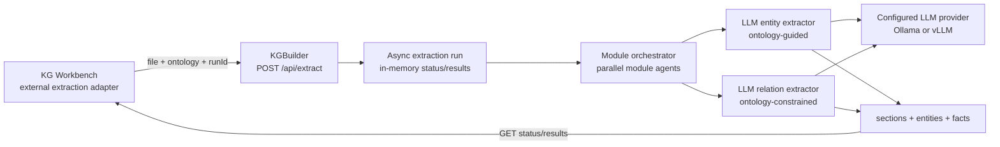
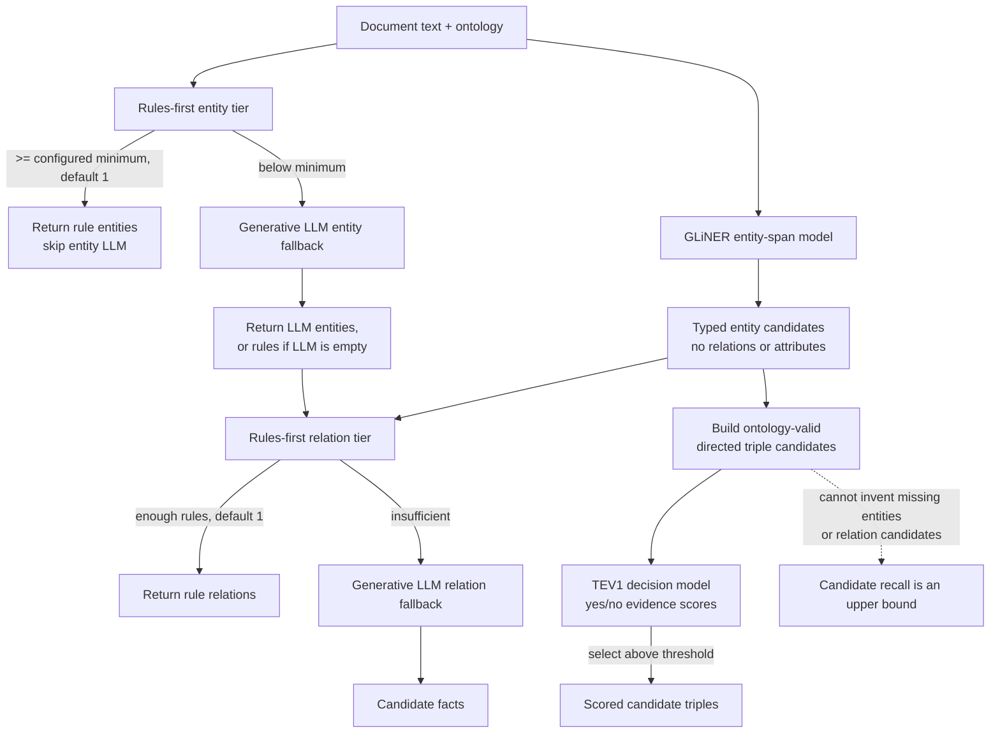
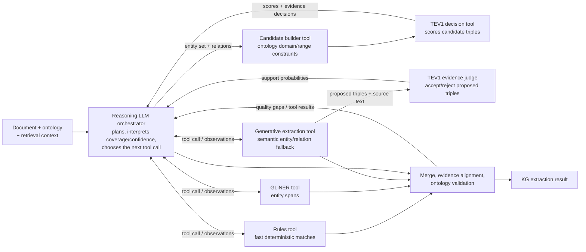

# Agentic Pipeline: Skills, Tools, and Subagents

## Why this exists

The original discovery loop made one hardcoded call sequence per research
question: retrieve -> extract -> extract relations -> static-validate. That
works, but it can't easily be reconfigured (different model per ontology
module, skip a stage, run validation instead of extraction) without editing
`IterativeDiscoveryLoop` itself.

This refactor introduces three small abstractions and layers them on top of
the existing extraction/validation code, without removing it:

- **Tool** (`kgbuilder.tools`) -- a thin, stateless wrapper around one
  existing capability (`extractor.extract(...)`, `validator.validate(...)`,
  a retriever call, ...). Tools have no framework dependency; they are
  ordinary dataclasses with a `handler` callable.
- **Skill** (`kgbuilder.skills`) -- composes one or more tools into a
  bounded unit of work ("retrieve, then extract", "retrieve, then validate").
- **Subagent** (`kgbuilder.agents`) -- a `BaseAgent` bound to specific
  resources (a retriever/extractor pair, an ontology module, a validator)
  that exposes skills as callable methods.

This mirrors how a LangChain/LangGraph tool-calling agent is built, but
every piece works standalone with plain Python objects — no LLM required to
drive the control flow itself. `PipelineAgent.run_plan()` executes a declared
plan deterministically; `LangChainReactAgent` is the separate LLM-driven
tool-calling adapter. The distinctions below are intentional: the public
extraction route does not yet use the latter as its top-level controller.

## Runtime architecture and model routing

### Current KG Workbench integration



`POST /api/extract` currently uses the submitted document directly; it does
not retrieve from the project's vector database. The module orchestrator
dispatches fixed entity and relation extraction stages. Both use the selected
generative LLM provider. GLiNER, rules, and TEV1 are not currently wired into
this public route.

### Existing extraction tiers and decision-model boundary



The current `TieredExtractor` and `TieredRelationExtractor` are early-exit
cascades: they skip the LLM stage when the corresponding rule extractor
returns at least its configured minimum (default one). These rule patterns
are domain-specific and are not a general-purpose ontology reasoner. GLiNER
is a separate entity-span path. TEV1 scores only the bounded, ontology-valid
triple candidates supplied to it; it is not a text-to-triples generator.

### Target: keep the LLM as the thinking/tool-routing agent



The LLM remains the system's reasoning and orchestration model in this target
design; smaller/deterministic models are tools it can call for bounded
subtasks. TEV1 does not replace that LLM. **This tool-calling control loop is
not yet implemented in `/api/extract`**: today TEV1 is exposed by the
benchmark's decision-relation extractor, called directly by the harness.
Likewise, `PipelineAgent` runs a declarative sequence rather than asking an
LLM to select tools dynamically. `LangChainReactAgent` provides a generic
tool-calling adapter, but it is not currently the extraction endpoint's
orchestrator.

### Decision models as evidence judges

A separate generative LLM is not required to judge whether a **proposed**
triple is supported by source text. `DecisionJudgedRelationExtractor` now
wraps a relation extractor and uses TEV1 yes/no decisions to filter its
proposals, preserving IDs and original evidence while recording support
probabilities. Enable this in the benchmark with `--decision-judge`.
This is distinct from enumerating all ontology-valid entity-pair candidates.
Candidate recall is reported for both modes, so a judge's precision gain
cannot hide missing proposals or reduced recall.

The judge does not generate missing facts, verify completeness, perform OWL
reasoning, or replace deterministic domain/range and evidence-offset checks.
Its scores are not yet calibrated on a held-out dataset. There was no existing
LLM-judge stage in the public route to replace: TEV judging is implemented and
benchmarkable, but not enabled in `/api/extract`. The target keeps the reasoning
LLM for planning and tool routing, and uses decision models for bounded judging.

| Path | Entity stage | Relation/triple stage | Current status |
|---|---|---|---|
| LLM baseline | Generative LLM | Generative LLM | Used by `POST /api/extract` |
| Rules-first | Rules; LLM only below the minimum result count | Rules; LLM only below the minimum | Available as a separate cascade; patterns are domain-specific |
| GLiNER hybrid | GLiNER spans | Usually a separate LLM or rules stage | Benchmarkable; GLiNER does not produce attributes |
| TEV1 hybrid | Supplied entity extractor (e.g. GLiNER) | Ontology-constrained candidates scored by TEV1 | Benchmark-only; candidate generation bounds recall |
| TEV1 evidence judge | Supplied entity extractor | Proposed relations from LLM/rules, filtered by TEV1 | Benchmark-only; retains original evidence |
| LLM tool-calling target | LLM chooses entity tools/fallbacks | LLM may invoke candidate builder and TEV1 tools | Planned; not wired into the public route |

See [model-provider and benchmark results](../guide/model-providers-and-benchmarks.md)
for the live development-pilot measurements and their limitations.

## Competency-question-driven routing

Per Keet & Khan's QuO model (arXiv:2412.13688), `CQType` classifies every
`ResearchQuestion`:

| CQType | Meaning | Routed to |
|--------|---------|-----------|
| **SCQ** (Scoping) | "What exists?" | Extraction subagents |
| **RCQ** (Relationship) | "How do things relate?" | Extraction subagents (relation-focused) |
| **VCQ** (Validating) | "Is what's in the KG correct/complete?" | `ValidationAgent` |
| **FCQ** (Foundational) | Align to a foundational ontology (CCO/BFO) | *(not yet wired to a pipeline stage)* |
| **MpCQ** (Metaproperty) | Classify by rigidity/identity/... | *(not yet wired to a pipeline stage)* |

`IterativeDiscoveryLoop` splits every batch of questions (initial and
follow-up) by `cq_type` before dispatching: SCQ/RCQ go to extraction, VCQ
goes to `ValidationAgent`. Nothing is silently dropped.

## Module-scoped extraction subagents

Ontology classes are grouped into modules via the `kg:module` SHACL/OWL
annotation (see `data/ontology/domain/decommissioning.owl`). Instead of one
monolithic extraction pass over the whole ontology:

```
OntologyService.get_module_class_map()
        │  {"Assets and Locations": ["Facility", ...], "Waste and Materials": [...], ...}
        ▼
OrchestratorAgent.build_module_bindings(module_map, questions, retriever, extractor)
        │  assigns each question to the module(s) owning its entity_class
        ▼
one ModuleExtractionAgent per module (own retriever/extractor pair)
        │  runs concurrently (ThreadPoolExecutor, max_workers)
        ▼
JoinModuleResultsSkill
        │  dedupes by (label, entity_type), keeps highest confidence, merges evidence
        ▼
merged entity list
```

Because each `ModuleBinding` carries its own retriever/extractor, different
modules can use different models — see [Agent Swarm Configuration](#agent-swarm-configuration)
below.

## Validation as a first-class stage

`ValidationAgent` (`agents/validation_agent.py`) consumes VCQ questions: for
each one, it retrieves evidence and asks a validator
`validate_question(question, evidence)` whether existing KG content answers
it correctly/completely. This is the pre-assembly validation-stage consumer
that was previously missing — VCQ questions were generated but never
executed.

Post-assembly validation (SHACL shapes, semantic rules, consistency
checking — the same checks `POST /validate` runs) is now also available as
tools (`kgbuilder.tools.kg_validation_tools`) and a combined skill
(`kgbuilder.skills.kg_validation_skill.KGValidationSkill`), so a
`pipeline.md` plan can invoke the same validation stage the FastAPI route
uses.

`LangChainReactAgent` adapts tools with structured JSON arguments. Inject
non-serializable service resources using `tool_bindings={tool_name: {...}}`;
only the tool's declared input schema is exposed to the model. Model arguments
cannot override injected resources. The capability composition template in
`agentic_pipeline/pipeline.md` needs explicit data/service bindings and is
not the build endpoint's executable plan.

## Agent Swarm Configuration

`kgbuilder.agents.swarm_config.SwarmModelConfig` lets you assign a
different (e.g. smaller/cheaper) model per ontology module and bound how
many module subagents run concurrently:

```json
{
  "backend": "ollama",
  "base_url": "http://localhost:11434",
  "default_model": "qwen3:8b",
  "module_models": {
    "Assets and Locations": "qwen3:1.7b",
    "Waste and Materials": "qwen3:8b"
  },
  "max_concurrent_agents": 3
}
```

See [`data/profiles/agent_swarm.example.json`](https://github.com/DataScienceLabFHSWF/KnowledgeGraphBuilder/blob/main/data/profiles/agent_swarm.example.json).
`build_module_bindings_with_swarm_config()` builds one retriever/extractor
pair per *distinct model* (shared across modules assigned that model) via
factory callables you supply, then hands the resulting `ModuleBinding` list
to `OrchestratorAgent(max_workers=swarm_config.max_concurrent_agents)`.

`experiment.config.KGBuilderParams` gained an optional `swarm_config_path`
field so benchmarking/experiment variants can reference a swarm config
alongside the existing single `model` field (backward compatible — unset
means "one model for everything", as before).

### Ollama vs. vLLM for concurrent subagents

The module orchestrator runs several subagents concurrently, each issuing
LLM calls against a shared inference backend. Two practical options:

- **Ollama (current default)** -- simplest to run locally, good model
  management (`ollama pull`), fine for a handful of concurrent
  small-to-medium models on a single GPU/CPU box. Ollama serializes/queues
  requests to the same loaded model rather than batching them, so
  concurrency gains from `max_concurrent_agents` mostly come from using
  *different* models per module (each gets its own request queue) rather
  than many parallel calls to one model.
- **vLLM** -- an OpenAI-compatible server with continuous batching and
  PagedAttention, built for exactly this "many concurrent requests to one
  model" pattern. It scales much better when several module subagents hit
  the *same* model concurrently, and can serve multiple models behind one
  process with better GPU utilization than several Ollama instances.

**Recommendation**: keep Ollama as the default for local development and
small swarms (a few modules, mostly-distinct small models — the common case
here). Consider vLLM once concurrency actually becomes the bottleneck: many
modules sharing one larger model, or when running experiments/benchmarks at
higher throughput. Switching backends is a client-construction concern only
(point an OpenAI-compatible client at the vLLM server); it does not require
changes to `ModuleExtractionAgent`, `OrchestratorAgent`, or `ValidationAgent`,
since they only depend on the `retriever`/`extractor`/`validator` protocols,
not on how those talk to the LLM. **Not implemented in this repo yet** — the
existing extractor/embedder classes are built against `ChatOllama` directly;
adding a vLLM-backed extractor is a follow-up, not a config toggle today.

## KG build endpoint

`POST /api/v1/build` runs the ontology-driven KG build using
[`agentic_pipeline/build_pipeline.md`](../../agentic_pipeline/build_pipeline.md)
and `PipelineAgent`, rather than a Python-defined sequence of extraction,
synthesis, assembly, and validation calls. The plan routes competency
questions to module-scoped extraction agents, extracts relations from
retrieved evidence, synthesizes findings, persists the graph, and optionally
validates it. The API still owns deterministic setup (loading the ontology,
retriever, extractors, stores, and job state); the markdown plan controls the
agentic work and its data flow.

With `run_validation=true`, setup generates SHACL shapes from the configured
ontology and binds a `SHACLValidator` into the validation skill alongside
rules and consistency checks. Empty shape generation, a missing validator,
or failed conformance cannot be reported as a successful validated build.
Validation currently covers the persisted store, not only nodes created by
this job: build nodes are not tagged for job-scoped validation. The shape
namespace matches the validator's RDF projection of graph types/properties.
Configured ontology reasoners require an ontology path and an errored check
fails aggregate validity rather than being treated as an unconfigured check.

Other older entry points have not all been migrated: `IterativeDiscoveryLoop`
still has a compatibility per-question path when no module map is supplied,
and `pipeline/orchestrator.py` retains its separate `BuildPipeline` API. Neither
is used by `POST /api/v1/build`. Document loading, chunking, and vector
indexing remain deterministic preprocessing stages.
